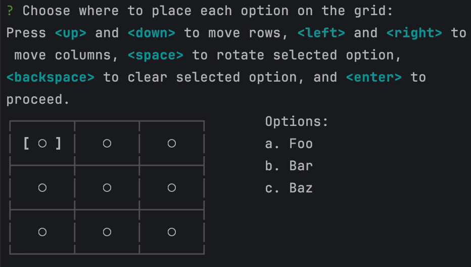

# inquirer-chessboard

> A chessboard-like prompt for [inquirer.js](https://github.com/SBoudrias/Inquirer.js) that allows placing multiple items on a grid.

Allows a user to select positions for multiple options on a grid and returns the grid values.

## Installation

```shell
npm install --save inquirer-chessboard
```

## Usage

Simply import the chessboard and call it with your desired options, then await.

The result will be a two-dimensional array containing passed option values as selected by the user.

```ts
import chessboard from 'inquirer-chessboard';

const options = ['Foo', 'Bar', 'Baz'];

chessboard({
    message: 'Choose where to place each option on the grid:',
    columns: 3,
    rows: 3,
    options: options.map((option) => ({name: option, value: option})),
}).then((answers) => {
    // Do something
    
    // answers will be a 3x3 array with user selections, eg.
    // [
    //   [ undefined, undefined, 'Foo'     ],
    //   [ 'Foo',     undefined, 'Bar'     ],
    //   [ undefined, 'Baz',     undefined ]
    // ]
})
```



### Options

| Option                     | Default    | Description                                                                                      |
|----------------------------|------------|--------------------------------------------------------------------------------------------------|
| message: String            | (required) | Prompt to display above the table                                                                |
| columns: number            | (required) | Number of columns to show in table                                                               |
| rows: number               | (required) | Number of rows to show in the table                                                              |
| options: Option<Value>[]   | (required) | Options to display for inputting in the table                                                    |
| rowLabels: string[]        | undefined  | If defined, shows labels left of each row of the table                                           |
| columnLabels: string[]     | undefined  | If defined, shows labels above each column of the table                                          |
| tableOptions: TableOptions | `{}`       | Options to pass to [cli-table](https://github.com/Automattic/cli-table) for displaying the table |
| wrapColumns: boolean       | `true`     | If true, arrowing past the horizontal edges of the table will wrap to the other side             |
| wrapRows: boolean          | `true`     | If true, arrowing past the vertical edges of the table will wrap to the other side               |
| theme: ChessboardTheme     | ...        | See theming section below                                                                        |

### Theming

A (partial) theme object can be passed to influence text element display. Internal formatting uses [chalk](https://github.com/chalk/chalk).
The theme object takes the following options:

| Option                                       | Default            | Description                                                                           |
|----------------------------------------------|--------------------|---------------------------------------------------------------------------------------|
| icon.unselected: string (char)               | figures.radioOff   | Character to display for undefined (initial state) unset table cells                  |
| icon.optionsList: string[] (char[])          | lowercase alphabet | Character to display to represent each option passed to the chessboard                |
| style.selectedIcon: (string) => string       | bolds input        | Formats an icon that is currently selected                                            |
| style.unselectedIcon: (string) => string     | unaltered          | Formats other icons that are not currently selected                                   |
| style.selectedOption: (string) => string     | bolds input        | Formats option that matches currently selected cell's value                           |
| style.unselectedOption: (string) => string   | unaltered          | Formats all other options                                                             |
| style.selectedCell: (string) => string       | `[ * ]`            | How to display currently selected cell/value. Default surrounds with square brackets. |
| style.unselectedCell: (string) => string     | `  *  `            | How to display not selected cell/values. Should be same length as selected            |
| style.renderOption: (option, icon) => string | `a. option value`  | How to combine icon and option for display value                                      |
| optionsDisplay: string                       | `'right'`          | Where to display options icon->name display in relation to the table                  |

# TODO

- [ ] Tests
- [ ] Paging?

# License

Copyright (c) 2025 FinalDoom
Licensed under the MIT license.